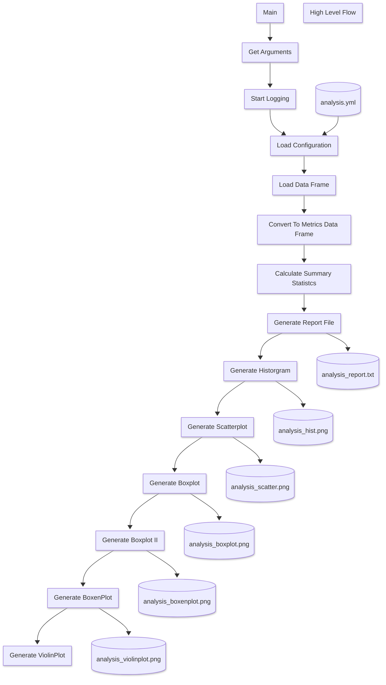

# pands-project
ATU Data Analytics Post Grad Diploma - Project

## Project Overview

### Project : Iris Data Analysis
### Author : Clyde Watts
### Date : 2025-04-01
### Course : ATU Post Grad Diploma in Data Analytics
### Module : Principles of Data Analytics
### Instructor : Andrew Beatty


## Command Line Arguments
The script takes the following command line arguments:

```bash
python analysis.py --config <config_file> --log_level <log_level> --write_config <write_config>

```
| Argument        | Description                                                                 |
|-----------------|-----------------------------------------------------------------------------|
| --config        | Path to the configuration file (YAML format)                               |
| --log_level     | Logging level (DEBUG, INFO, WARNING, ERROR, CRITICAL)                      |
| --write_config  | Write the configuration to a file (YAML format)                            |
|-----------------|-----------------------------------------------------------------------------|


## Configuration File
The configuration file is in YAML format and contains the following sections:

'''yaml

source_columns:
- sepal_length
- sepal_width
- petal_length
- petal_width
- speciesV
source_csv_file: iris.data
source_path: c:\Users\cw171001\OneDrive - Teradata\Documents\Data_Analytics_2025_ATU\pands\pands-project
target2_box: analysis_plot_box_II.png
target2_boxen: analysis_plot_boxen_II.png
target2_violin: analysis_plot_violin_II.png
target_box: analysis_plot_box.png
target_histogram: analysis_plot_histograms.png
target_path: c:\Users\cw171001\OneDrive - Teradata\Documents\Data_Analytics_2025_ATU\pands\pands-project
target_report: analysis_report.txt
target_scatter: analysis_plot_scatter.png

```


## Flowchart



## Files

| Directory     | File Name             | Description                            | Notes                         |
|--------------:|----------------------:|---------------------------------------:|-------------------------------|
| .             | analysis.py           | Primary project python script          |                               |
| .             | anaysis_notebook.ipynb| Project Supporting Notebook            |                               |
| .             | Index                 | Iris Index                             | Source                        |
| .             | iris.data             | Iris Data - CSV                        | CSV - no bom , linux          |
| .             | iris.names            | Iris Names                             | Iris Data - Names             |
| .             | bezdekItis.data       | Iris Data - CSV                        | CSV - no bom , linux          |
| .             | README.md             | This file                              |                               |
| .             | analysis_report.txt   | Analysis Report                        |                               | 
| .             | analysis.log          | Script Log file                        |                               |
| .             | analysis_plot_hist.png| Histogram of the Iris Data             |                               |   
| .             | analysis_plot_scatter.png| Scatterplot of the Iris Data        |                               |
| .             | analysis_plot_box.png | Boxplot of the Iris Data               |                               |
| .             | analysis_plot_boxen.png| Boxenplot of the Iris Data            |                               |
| .             | analysis_plot_violin.png| Violinplot of the Iris Data         |                               | 
| .             | analysis_plot_box_II.png| Boxplot II of the Iris Data         |                               |
| .             | analysis_plot_boxen_II.png| Boxenplot II of the Iris Data     |                               |
| .             | analysis_plot_violin_II.png| Violinplot II of the Iris Data   |                               |
| .             | analysis_plot_box_II.png| Boxplot II of the Iris Data         |                               |
| .             | analysis_plot_histogram_petal_length.png| Histogram of the Petal Length |                               |
| .             | analysis_plot_histogram_petal_width.png| Histogram of the Petal Width   |                               |
| .             | analysis_plot_histogram_sepal_length.png| Histogram of the Sepal Length |                               |
| .             | analysis_plot_histogram_sepal_width.png| Histogram of the Sepal Width   |                               |
| .             | analysis_kmeans_cluster.ipynb| KMeans Clustering Notebook         |                               |
| .             | analysis_dbscan_cluster.ipynb| DBSCAN Clustering Notebook           |                               |

### File : iris.data file format

The iris dataset is a tiny dataset which is used for projects , this one included. The iris dataset consists of 4 features ( properties) and 1 target . The 4 features are the petal length and width , and the sepal length and width ( no idea what a sepal is). The target is the iris flower type , setosa, versicolor or virginica. There is a sample of 50 of each flower species ( target). The features are all measured in cm , and the target is a varchar string of the species.


| Attribute Name | Type    | Description                                                                 |
|----------------|---------|-----------------------------------------------------------------------------|
| sepal_length   | float   | Length of the sepal in centimeters                                          |
| sepal_width    | float   | Width of the sepal in centimeters                                           |
| petal_length   | float   | Length of the petal in centimeters                                          |
| petal_width    | float   | Width of the petal in centimeters                                           |
| class          | string  | Class of the iris flower (Iris-setosa, Iris-versicolor, Iris-virginica)     |

### File : parameters.yaml file format
The parameters.yaml file is a configuration file that contains the parameters used in the analysis. The parameters are used to set the paths for the input and output files, as well as the columns to be used in the analysis.

```yaml
feature_columns:
- sepal_length
- sepal_width
- petal_length
- petal_width
source_columns:
- sepal_length
- sepal_width
- petal_length
- petal_width
- species
source_csv_file: iris.data
source_path: c:/Users/cw171001/OneDrive - Teradata/Documents/Data_Analytics_2025_ATU/pands/pands-project
target2_box: analysis_plot_box_II.png
target2_boxen: analysis_plot_boxen_II.png
target2_violin: analysis_plot_violin_II.png
target_box: analysis_plot_box.png
target_columns:
- species
target_histogram_combined: analysis_plot_histograms_combined.png
target_histogram_feature: analysis_plot_histogram_feature.png
target_path: c:/Users/cw171001/OneDrive - Teradata/Documents/Data_Analytics_2025_ATU/pands/pands-project
target_report: analysis_report.txt
target_scatter: analysis_plot_scatter.png
'''
## References

- [Wikipedia: Iris Flower Data Set](https://en.wikipedia.org/wiki/Iris_flower_data_set)
- [Irish Data Set]https://archive.ics.uci.edu/dataset/53/iris
- [Iris Dataset: Fisher, R. (1936). Iris [Dataset]. UCI Machine Learning Repository. ]https://doi.org/10.24432/C56C76.
- https://www.geeksforgeeks.org/multi-plot-grid-in-seaborn/
- https://www.cuemath.com/geometry/area-of-an-ellipse/
- datacamp.com : The data analytics course I am currently taking
- https://www.statology.org/seaborn-table/ : Used to create the table to the side of a table
- https://seaborn.pydata.org/generated/seaborn.catplot.html : Used to create the catplot - boxplot,violinplot,boxenplot
- https://seaborn.pydata.org/generated/seaborn.violinplot.html#seaborn.violinplot : Used to create the violinplot
- https://seaborn.pydata.org/generated/seaborn.boxenplot.html#seaborn.boxenplot : Used to create the boxenplot
- Google Gemini : What is a violin plot?
- Google Gemini : What is a boxen plot?
- kmeans clustering: https://www.datacamp.com/tutorial/k-means-clustering-python?utm_source=google&utm_medium=paid_search&utm_campaignid=19589720821&utm_adgroupid=157156374951&utm_device=c&utm_keyword=&utm_matchtype=&utm_network=g&utm_adpostion=&utm_creative=733936221293&utm_targetid=aud-1832882613722:dsa-2218886984380&utm_loc_interest_ms=&utm_loc_physical_ms=1007877&utm_content=&accountid=9624585688&utm_campaign=230119_1-sea~dsa~tofu_2-b2c_3-emea_4-prc_5-na_6-na_7-le_8-pdsh-go_9-nb-e_10-na_11-na&gad_source=1&gclid=Cj0KCQjwv_m-BhC4ARIsAIqNeBtcqQxamZLbu_HZzz-KqeYXnvGMhbiqEAkhefWZntcQgx3jKP1Yy2IaAuKgEALw_wcB